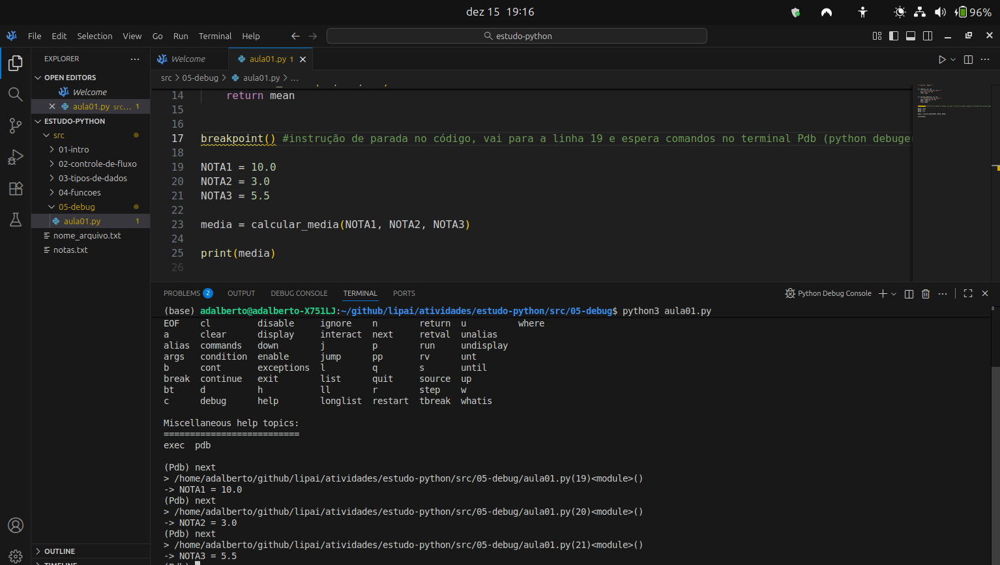
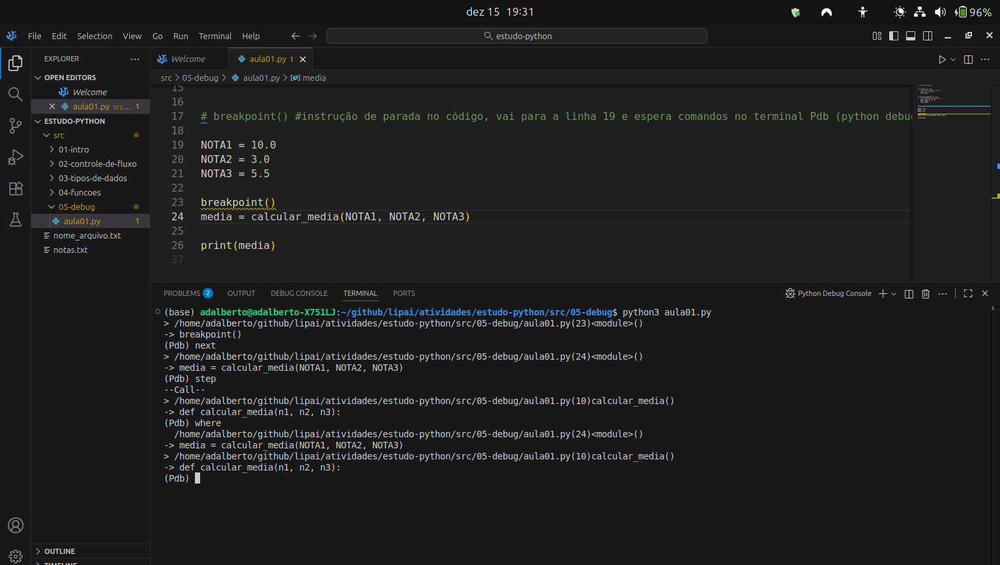
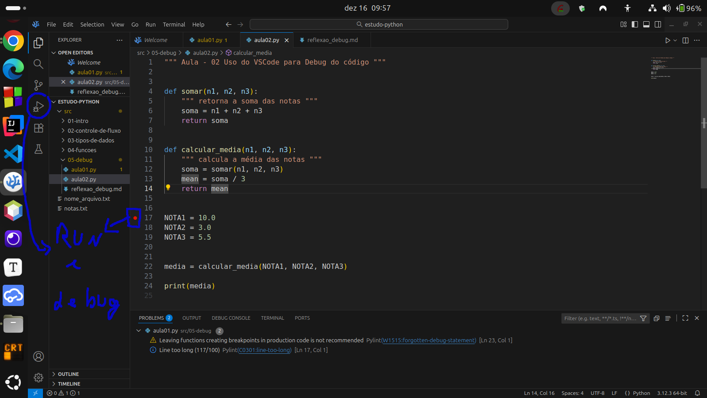
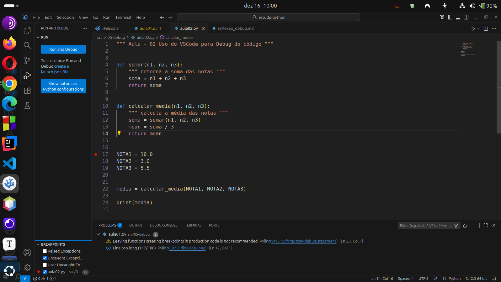
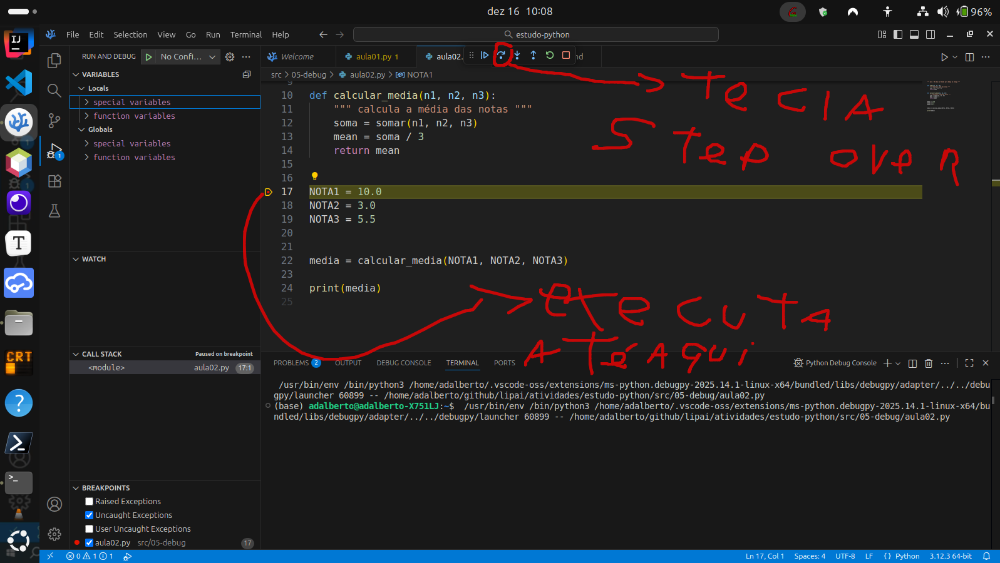
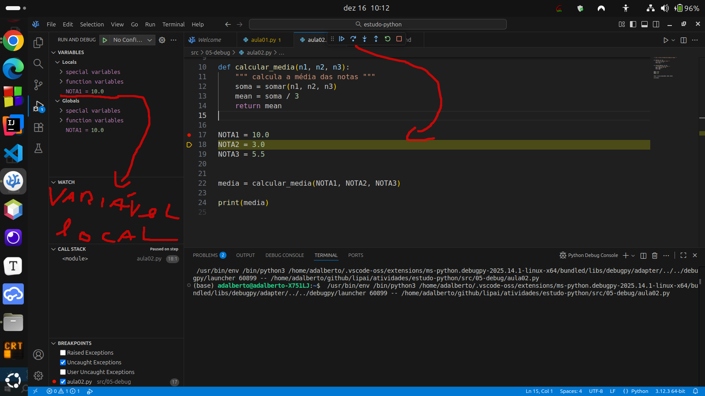
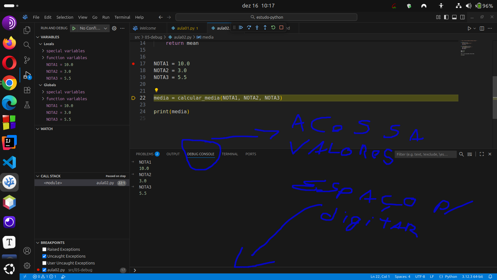
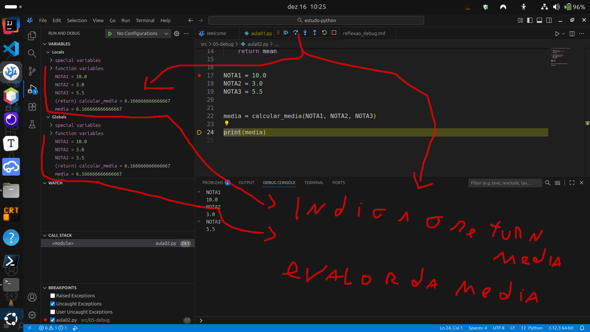
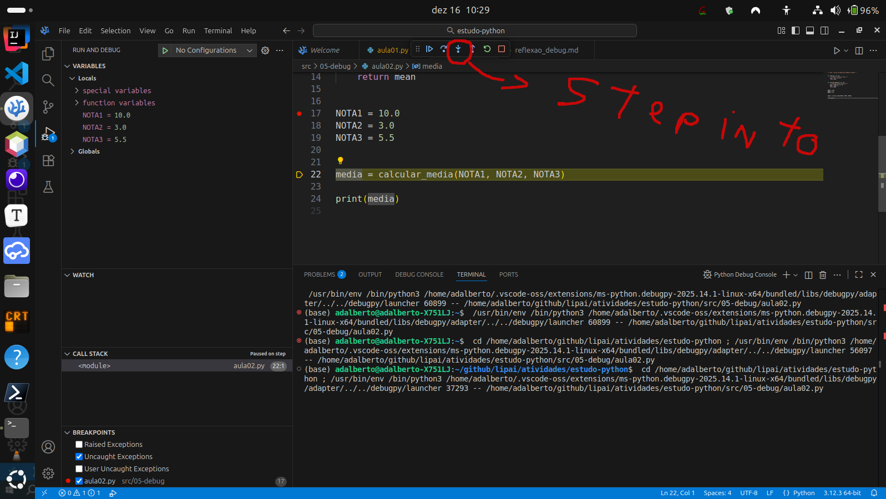
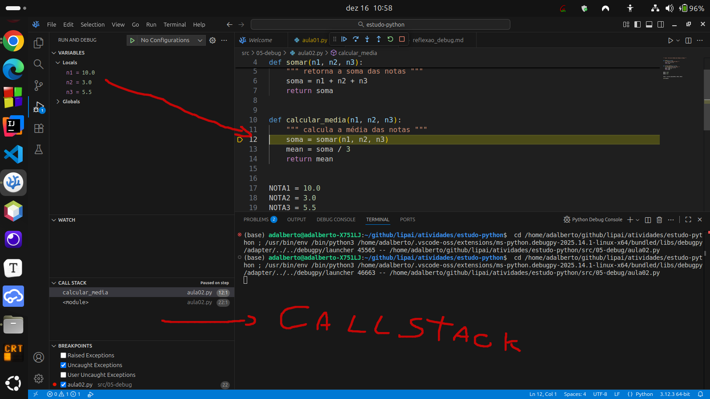

# Atividade S3 A1

**Nome**: Adalberto Caldeira Brant Filho  
**Repositório GitHub**: https://github.com/adalbertobrant/lipai

## Código das Videoaulas

## Depuração em Python com PDB e VS Code

Utilizando o Pdb 

```python3 
""" Aula 01 - Debug """


def somar(n1, n2, n3):
    """ retorna a soma das notas """
    soma = n1 + n2 + n3
    return soma


def calcular_media(n1, n2, n3):
    """ calcula a média das notas """
    soma = somar(n1, n2, n3)
    mean = soma / 3
    return mean

breakpoint() // cria um ponto de parada 

NOTA1 = 10.0
NOTA2 = 3.0
NOTA3 = 5.5

media = calcular_media(NOTA1, NOTA2, NOTA3)

print(media)

```
Ao criar o comando breakpoint() no Python, abre-se a possibilidade de conseguir através do Python debug, usar uma série de comandos que podem ser visualizados no terminal pdb:
```python3
# comando help
# faz a listagem de comandos possíveis de se utilizar no pdb

# comando next
# vai para o próximo comando

# chamada de variável 
# pode-se chamar uma variável após um comando como o next, pois ela já está dentro da memória, bastando usar o nome da varíavel no pdb, ajuda a inspecionar valores 

# comando step
# serve para entrar dentro de uma chamada de função

# comando where
# mostra aonde o cursor está no momento e a pilha de execução callstack

```


O comando breakpoint é uma função em python que ajuda a fazer o debug do código , na figura vemos o comando breakpoint() na linha 17 e a chamada do comando help no terminal pdb 



O comando next do pdb ajuda a ver linha a linha a execução do programa , pois o mesmo é executado linha a linha, após ser executada uma variável pode-se chamar a mesma para ver o seu valor 



O comando step entra dentro de uma função e é usado em conjunto com o comando next , o comando where mostra a pilha de execução apontando a linha do programa principal, e depois a sua chamada de função como mostra a figura acima

O comando step dá sempre um passo enquanto que o comando next vai seguindo a pilha de execução principal do programa ignorando subrotinas.


## Aula 02 - Depuração com o VSCode

 No VSCode para utilizar o breakpoint é necessário clicar com o botão direito do mouse do lado esquerdo da numeração da linha do código. 



 Deve-se clicar em Run and Debug 


 Para ir para a próxima execução de código usa-se a tecla de atalho F10 ou então clica na seta que se chama step over como indica a figura abaixo:


 Ao clicar em step over notamos que a NOTA1=10 aparece como variável local e o debug indica que está na próxima linha como podemos notar pela figura abaixo:


 Existe também um espaço no VSCode chamado debug console, onde podemos acessar as variáveis já em memória ou que já foram executadas pelo debug , como indica a figura a seguir:


 Ao executarmos o step over na próxima linha que será o cálculo da média notamos que é retornado o valor do cálculo da média e também o retorno da função calcular_media(NOTA1, NOTA2, NOTA3), isso indica que o step over não entra dentro da função e teremos que usar outra ferramenta visual do debug para ver o que está se passando dentro da função calcular_media(), observe a figura abaixo:
 

  Para conseguir acessar o que acontece dentro da função calcular_media() usamos o step into que é a tecla F11 do VSCode, essa tecla possibilida o acesso a função calcular_media(), veja a figura:


  O call stack então nos mostra a pilha de execução do nosso programa e também mostra as linhas que estão sendo executadas.


  O Debug do python tanto na parte do terminal que é mais direta quanto na parte visual é um auxiliar importante para a depuração e melhoria do código, evitando utilizar prints 

## Reflexão_debug.md

● O que você conseguiu enxergar no debugger que não ficava tão claro apenas
executando o programa normalmente (sem depuração)?

 R: O pdb ajuda a entender o fluxo e estrutura do código melhor do que apenas ver onde está o erro, como normalmente se utiliza ao fazer o ato de degub usando o comando print

● Em quais situações você acha mais prático usar o pdb pela linha de
comando e em quais prefere o debugger visual do VS Code?

R: Na linha de comando é mais fácil senão tivermos acesso a um sistema visual, não notei até o momento muitas diferenças entre um e outro, talvez no VS Code seja relativo a questões onde eu tenha que ver a callstack completa do programa

● Houve algum erro ou comportamento inesperado nos seus exercícios que
você só percebeu por causa da depuração? Descreva brevemente.

R: Sim, chamada de pilhas muitas vezes podem ser complexas e podendo ver a questão da depuração passo a passo e o desvio do fluxo da execução me ajuda a entender melhor onde está o bug.

