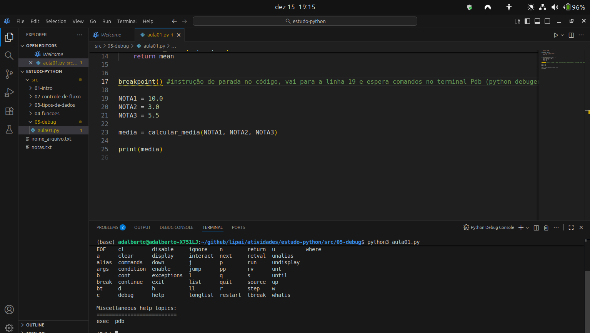

# **Nome**: Adalberto Caldeira Brant Filho  
**Repositório GitHub**: https://github.com/adalbertobrant/lipai

## Código das Videoaulas

## Depuração em Python com PDB e VS Code

Utilizando o Pdb 

```python3 
""" Aula 01 - Debug """


def somar(n1, n2, n3):
    """ retorna a soma das notas """
    soma = n1 + n2 + n3
    return soma


def calcular_media(n1, n2, n3):
    """ calcula a média das notas """
    soma = somar(n1, n2, n3)
    mean = soma / 3
    return mean

breakpoint() // cria um ponto de parada 

NOTA1 = 10.0
NOTA2 = 3.0
NOTA3 = 5.5

media = calcular_media(NOTA1, NOTA2, NOTA3)

print(media)

```
Ao criar o comando breakpoint() no Python, abre-se a possibilidade de conseguir através do Python debug, usar uma série de comandos que podem ser visualizados no terminal pdb:
```python3
# comando help
# faz a listagem de comandos possíveis de se utilizar no pdb

# comando next
# vai para o próximo comando

# chamada de variável 
# pode-se chamar uma variável após um comando como o next, pois ela já está dentro da memória, bastando usar o nome da varíavel no pdb, ajuda a inspecionar valores 

# comando step
# serve para entrar dentro de uma chamada de função

# comando where
# mostra aonde o cursor está no momento e a pilha de execução callstack

```

https://github.com/adalbertobrant/lipai/tree/main/imgs/atividade_S3_A1



O comando breakpoint é uma função em python que ajuda a fazer o debug do código , na figura vemos o comando breakpoint() na linha 17 e a chamada do comando help no terminal pdb 


O comando next do pdb ajuda a ver linha a linha a execução do programa , pois o mesmo é executado linha a linha, após ser executada uma variável pode-se chamar a mesma para ver o seu valor 


O comando step entra dentro de uma função e é usado em conjunto com o comando next , o comando where mostra a pilha de execução apontando a linha do programa principal, e depois a sua chamada de função como mostra a figura acima

O comando step dá sempre um passo enquanto que o comando next vai seguindo a pilha de execução principal do programa ignorando subrotinas.


