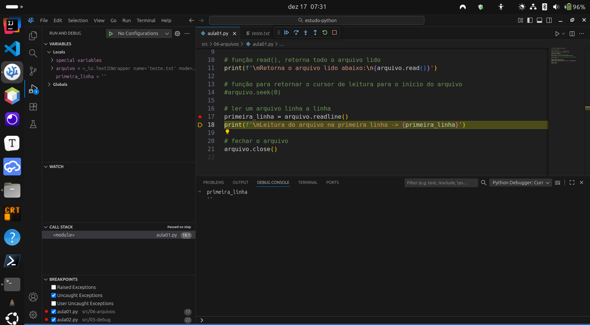
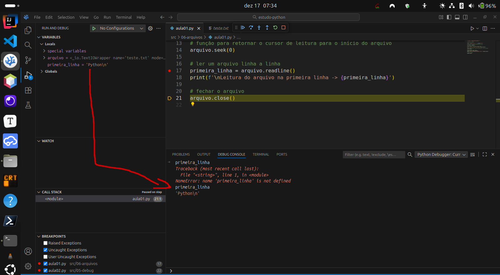
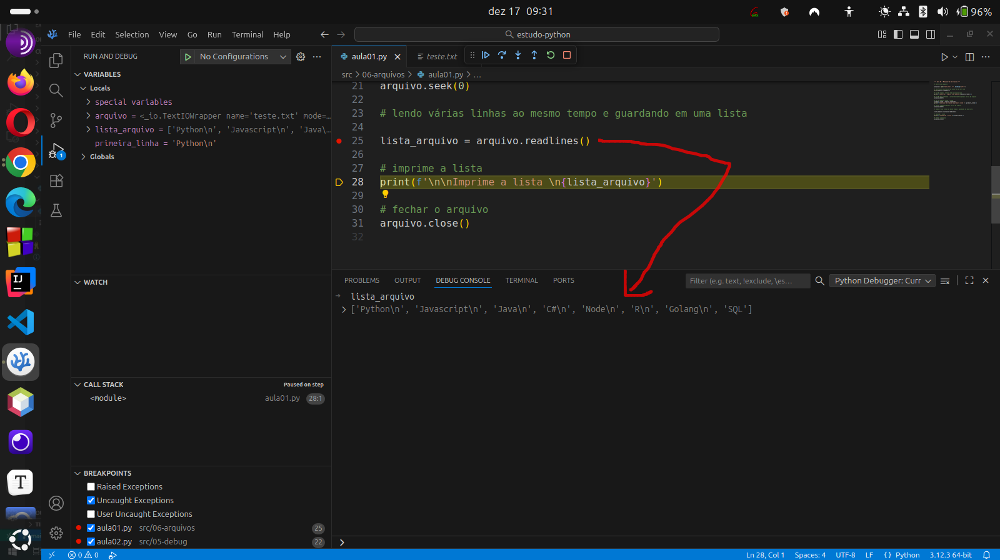
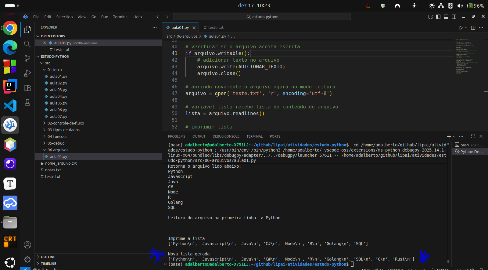
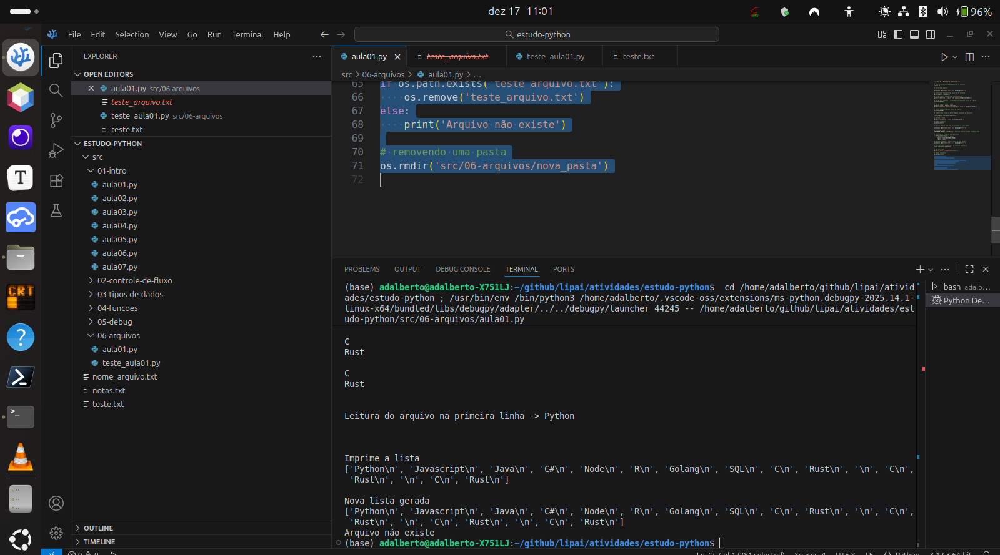

# Atividade S3 A2

**Nome**: Adalberto Caldeira Brant Filho  
**Repositório GitHub**: https://github.com/adalbertobrant/lipai

## Código das Videoaulas

  A função open() em python é utilizada para abrir arquivos em diretórios uma das formas que pode ser escrita é:
  ```python3
  # abre arquivo , nome do arquivo, modo de leitura, codificação do arquivo (opcional)
  open("caminho_do_arquivo.extensão", "modo_de_abertura_do_arquivo", enconding='tipo_de_codificação_do_arquivo')
     # resto do programa
  ```
  Tabela com modos de abertura de arquivos em python

  |  Símbolo  |  Explicação            |
  | :---      | :---                   |
  |  r        |  leitura               |
  |  a        |  append / incrementar  |
  |  w        |  escrita               |
  |  x        |  criar arquivo         |
  |  r+       |  leitura e escrita     |

  ```python3
""" Aula 01 - Manipulação de Arquivos """

# abertura do arquivo

arquivo = open("src/06-arquivos/teste.txt", "r", encoding='utf-8')

# verifica se o arquivo tem condições de ser lido
print(arquivo.readable())


# fechar o arquivo
arquivo.close()
  ```
  A função readable() verifica se o arquivo pode ser lido ou não, ou seja se o mesmo foi aberto com autorização de leitura, caso tenha sido escrito na forma:
```python3
arquivo = open('teste.txt', 'w',enconding='utf-8')
print(arquivo.readable())
```
  O resultado esperado é False, pois o arquivo tem apenas a propriedade de escrita que é ' w '.
  Podemos ler todo um arquivo usando a função read():
```python3
# abertura do arquivo

arquivo = open("src/06-arquivos/teste.txt", "r", encoding='utf-8')

# verifica se o arquivo tem condições de ser lido
print(arquivo.readable())

# função read(), retorna todo o arquivo lido
print(f'\nRetorna o arquivo lido abaixo:\n{arquivo.read()}')

# fechar o arquivo
arquivo.close()
```
  O resultado desse código é demonstrado abaixo:


  Ao executar o tutorial do vídeo explicativo, como não comentei as linhas a próxima função a ser estudada que é a readline(), estava retornando linha vazia, pois ao executar a função read() o python leu já todo o arquivo e está no final dele.
  Para que o python volte ao ponto inicial do arquivo é necessário indicar isso através do comando seek():
```python3
""" Aula 01 - Manipulação de Arquivos """

# abertura do arquivo

arquivo = open("teste.txt", "r", encoding='utf-8')

# verifica se o arquivo tem condições de ser lido
print(arquivo.readable())

# função read(), retorna todo o arquivo lido
print(f'\nRetorna o arquivo lido abaixo:\n{arquivo.read()}')

# função para retornar o cursor de leitura para o início do arquivo
arquivo.seek(0)

# ler um arquivo linha a linha
primeira_linha = arquivo.readline()
print(f'\nLeitura do arquivo na primeira linha -> {primeira_linha}')

# fechar o arquivo
arquivo.close()
```
  Note pelas figuras a seguir que sem o comando seek() o retorno da variável primeira_linha é uma string vazia:



  Agora com o comando seek() temos o retorno esperado para a variável primeira_linha:


  Também podemos ler todas as linhas de um arquivo e armazenar em uma lista usando a função readlines():
  ```python3
# lendo todas as linahs do arquivo e guardando em uma lista

lista_arquivo = arquivo.readlines()

# imprime a lista
print(f'\n\nImprime a lista \n{lista_arquivo}')
  ```


  Note que a saída do arquivo lista_arquivo tem a linha completa inclusive com o '\n' separador de linha.

  Podemos também no nosso arquivo ' teste.txt ' adicionar mais texto, no caso linguagens de programação, para isso devemos fechar o arquivo e então modificar o arquivo de 'r' read para 'a' que é append, se colocarmos 'w' podemos sobreescrever todo o nosso arquivo, então devemos ter esse cuidado em arquivos que já existem é necessário utilizar o comando append.
```python3
""" Aula 01 - Manipulação de Arquivos """

# abertura do arquivo

arquivo = open("teste.txt", "r", encoding='utf-8')

# verifica se o arquivo tem condições de ser lido
print(arquivo.readable())

# função read(), retorna todo o arquivo lido
print(f'\nRetorna o arquivo lido abaixo:\n{arquivo.read()}')

# função para retornar o cursor de leitura para o início do arquivo
arquivo.seek(0)

# ler um arquivo linha a linha
primeira_linha = arquivo.readline()
print(f'\nLeitura do arquivo na primeira linha -> {primeira_linha}')

# voltar o arquivo para o início do arquivo
arquivo.seek(0)

# lendo várias linhas ao mesmo tempo e guardando em uma lista

lista_arquivo = arquivo.readlines()

# imprime a lista
print(f'\n\nImprime a lista \n{lista_arquivo}')

# fechar o arquivo
arquivo.close()

# abrir o arquivo para modo de adicionar no final append

arquivo = open("teste.txt", "a", encoding='utf-8')

# adicionar texto
ADICIONAR_TEXTO = '\nC\nRust\n'  # pois o anterior estava na mesma linha

# verificar se o arquivo aceita escrita
if (arquivo.writable()):
    # adicionar texto no arquivo
    arquivo.write(ADICIONAR_TEXTO)
    arquivo.close()

# abrindo novamente o arquivo agora no modo leitura
arquivo = open('teste.txt', 'r', encoding='utf-8')

# variável lista recebe lista do conteúdo de arquivo
lista = arquivo.readlines()

# imprimir lista
print(f'\nNova lista gerada\n{lista}')

# fechar o arquivo
arquivo.close()
```

  Podemos também utilizar a função writable() para verificar se o arquivo pode ser escrito e só depois escrever o mesmo, vomo foi feito no código acima.

  No python não é possível depois de usar open sem antes fechar o mesmo, alterar a característica do mesmo, se para leitura , escrita ou adição, veja o que acontece se fizermos um programa para dar dois open's e só depois um close():

```python3
""" teste para ver se o open funciona ao ter um arquivo já usando ele """
# abre arquivo para escrita
arquivo = open('teste_arquivo.txt', 'w', encoding='utf-8')

# escreve no arquivo
arquivo.write('Escrevendo algo no arquivo\n')

# testa se o arquivo pode ser lido
if arquivo.readable():
    print('O arquivo pode ser lido')
else:
    print('Arquivo não pode ser lido')

# tentativa de abrir o arquivo para leitura
arquivo_leitura = open('teste_arquivo.txt', 'r', encoding='utf-8')

# testa se o arquivo foi lido e aberto
if arquivo_leitura.readable():
    print(arquivo_leitura.readlines())
```
![Variável arquivo_leitura retorna vazio '[]'](../../../imgs/atividade_S3_A2/arquivos_06.png)

  Notamos que apesar de termos dado um novo nome a varíavel arquivo_leitura ela abre o arquivo do mesmo local mas não consegue proceder com a leitura e retorna vazia, isso acontece no python pois o arquivo ainda está aberto para escrita.

  Podemos também importar a biblioteca os do python para manipularmos arquivos usando o sistema operacional.
  Com isso podemos remover diretórios usando o os.rmdir(nome_diretório), desde que o mesmo esteja vazio e também removermos arquivos desde que os mesmos tenham sido fechados antes:
```python3
# removendo arquivo
# os.remove('teste_arquivo.txt')

# verificando se o arquivo pode ser removido ou não
if os.path.exists('teste_arquivo.txt'):
    os.remove('teste_arquivo.txt')
else:
    print('Arquivo não existe')

# removendo uma pasta
os.rmdir('src/06-arquivos/nova_pasta')
```


