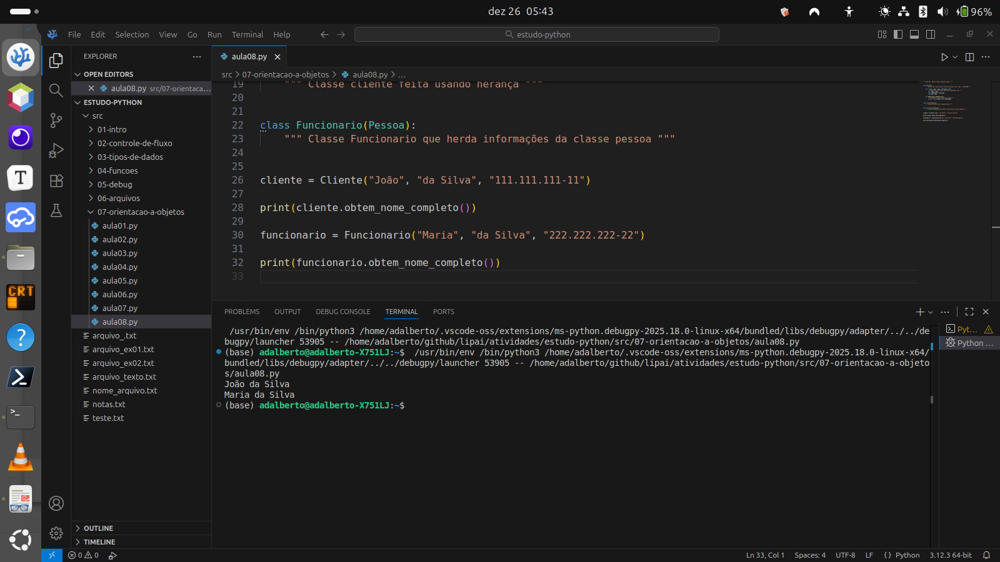
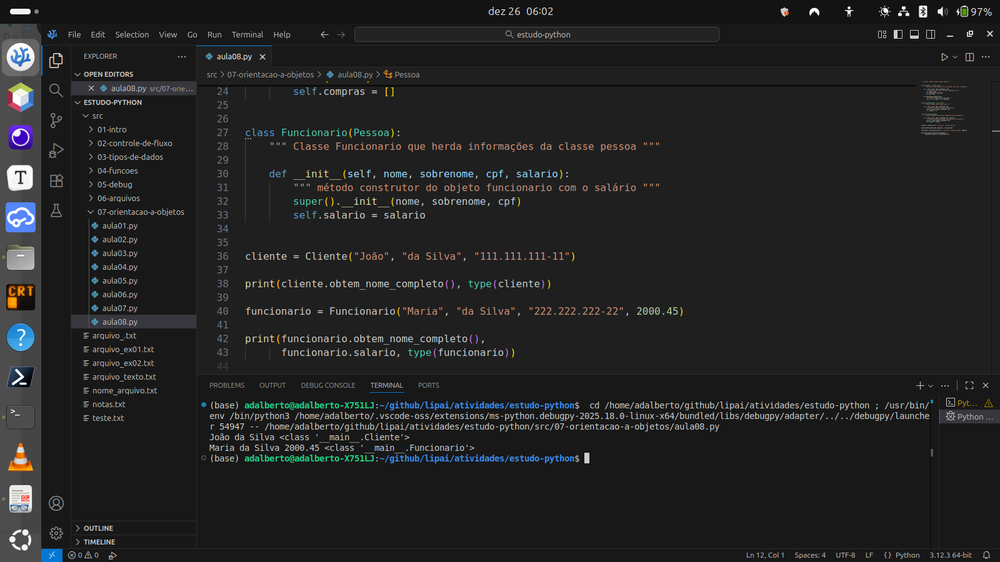
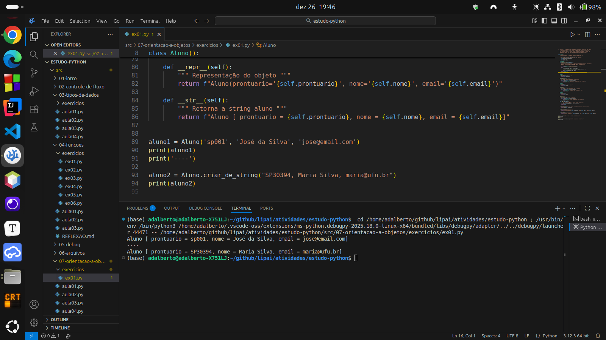
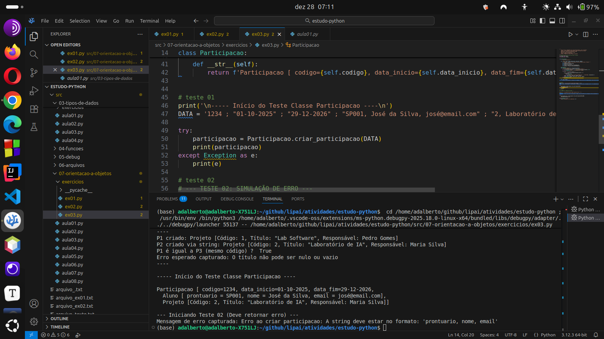
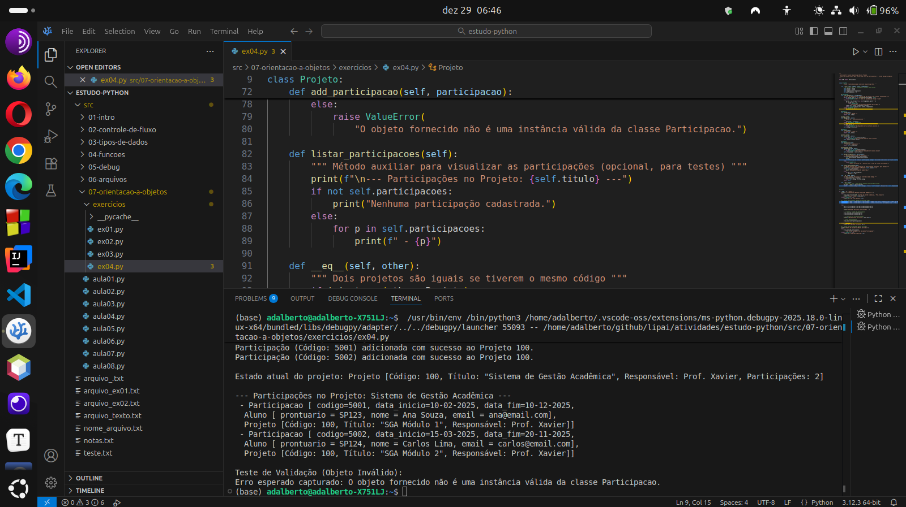

# Atividade S3 A3

**Nome**: Adalberto Caldeira Brant Filho  
**Repositório GitHub**: https://github.com/adalbertobrant/lipai

## Código das Videoaulas

## Aula 01 - Introdução a Orientação a objetos

A Orientação a objetos é um paradigma de programação, ela consegue representar os dados e também as funções de algo, veja o exemplo abaixo que não é orientado a objetos:

```python3
# calcule a área e perimetro do retangulo


def calcular_area(retangulo):
    """ retorna a área do retângulo """
    return retangulo['base'] * retangulo['altura']


def calcular_perimetro(retangulo):
    """ retorna o perimetro de um retangulo """
    return 2 * (retangulo['base'] + retangulo['altura'])


# declaração dos retângulos

retangulo1 = {
    'base': 10.0,
    'altura': 5.0
}

retangulo2 = {
    'base': 6.0,
    'altura': 3.0
}

print(f'Area retangulo 1 {calcular_area(retangulo1)}')
print(f'Perimetro retangulo 1 {calcular_perimetro(retangulo1)}')
print()
print(f'Area retangulo 2 {calcular_area(retangulo2)}')
print(f'Perimetro retangulo 1 {calcular_perimetro(retangulo1)}')
```
Nesse código que usa o paradigma estruturado, observamos que não temos condições de aproveitar muito o código e que a inserção de novas variáveis retangulo deve ser feita dentro do próprio programa em questão. A estrutura que armazena os dados (variáveis), está separada dos algoritmos que efetuam os cálculos.
Observe o mesmo programa agora escrito em orientação a objetos:

```python3
# Classe representa um conceito
# Classe representa um retangulo
# Classe possui atributos: base e altura
# Classe possui métodos
class Retangulo:
    """ Classe Retangulo """
# criação de métodos de instância

    def __init__(self, base, altura):
        self.base = base
        self.altura = altura

    def calcular_area(self):
        """ retorna a área do retângulo """
        return self.base * self.altura

    def calcular_perimetro(self):
        """ retorna o perimetro de um retangulo """
        return 2 * (self.base + self.altura)


# instanciando objetos dos tipo retangulo
# chamando o método construtor da classe
retangulo1 = Retangulo(10.0, 5.0)
retangulo2 = Retangulo(6.0, 3.0)

print(type(retangulo1))

print(retangulo1.base, retangulo1.altura)
print(type(retangulo1.base), type(retangulo1.altura))

print(retangulo2.base, retangulo2.altura)

print(f"Área retangulo 1 -> {retangulo1.calcular_area()}")
print(f"Área retangulo 2 -> {retangulo2.calcular_area()}")
```
## Aula 02 - Atributos de classe e instância

   Atributos de instância são atributos que associamos a um objeto específico 
   Atibutos de Classes está associado a classe do objeto e normalmente são valores já definidos, o acesso ao atributo de classe é feito usando o nome da classe e a variável ou então no objeto criado e a variável da classe.
   Caso o atributo de classe seja mudado na instância ele é refletido apenas na instância criada.
```python3

""" Aula 02 - Atributos de classe e instância """


class Pessoa:
    """ Classe Pessoa """

    # atributo de classe
    especie = 'Humano'

    def __init__(self, nome, email):
        """ atributos de instância: nome , email """
        self.nome = nome
        self.email = email


pessoa1 = Pessoa('Maria da Silva', 'maria@email.com')
pessoa2 = Pessoa('João Santos', 'joao@email.com')

# imprimir dados da Pessoa
print(pessoa1.nome, pessoa1.email)
print(pessoa2.nome, pessoa2.email)
print('------')
# dados da pessoa com atributo de classe
print(pessoa1.nome, pessoa1.email, pessoa1.especie)
print(pessoa2.nome, pessoa2.email, pessoa2.especie)
print('------')
# dados de atributo de classe acessando a classe
print(Pessoa.especie)
print('------')
# alterar um atributo de classe na instância (objeto) altera somente para aquela instância
print("Alterando pessoa1.especie para alien")
pessoa1.especie = 'Alien'
print(pessoa1.nome, pessoa1.email, pessoa1.especie)
print('------')
# alterar um atributo de classe na classe altera para todos os objetos e na classe também.
# desde que aquela instância gerada não tenha sido alterada anteriormente.
Pessoa.especie = "Anunakis"
print(pessoa1.nome, pessoa1.email, pessoa1.especie)
print(pessoa2.nome, pessoa2.email, pessoa2.especie)
```

   A figura mostra a alteração do atributo de classe note que a pessoa1 manteve o atributo anteriormente designado para ela.

## Aula 03 - Métodos de classe

   Métodos de classe são executados sem precisar de uma instância de uma classe, podem ser usados para criar um objeto de uma forma mais conveniente ou gerenciar um recurso compartilhado.
   O @classmethod é um método de classe e não de instância ele é um decorator da linguagem python
   O acesso ao método da classe se dá usando o nome da classe e seu método, veja o código abaixo:
```python3
""" Aula 03 - Métodos de classe """

# calcule a área e perimetro do retangulo


class Retangulo:
    """ Classe retangulo """

    def __init__(self, base, altura):
        """ construtor classe retangulo """
        self.base = base
        self.altura = altura

    @classmethod
    def from_list(cls, lista):
        """ cria uma instância usando o decorator classmethod a partir de uma lista"""
        return cls(lista[0], lista[1])

    @classmethod
    def from_string(cls, rep_retangulo):
        """ cria uma instância a partir de uma string """
        base, altura = rep_retangulo.split(sep=',')
        return cls(float(base), float(altura))

    def calcular_area(self):
        """ retorna a área do retângulo """
        return self.base * self.altura

    def calcular_perimetro(self):
        """ retorna o perimetro de um retangulo """
        return 2 * (self.base + self.altura)


retangulo1 = Retangulo(10.0, 5.0)
retangulo2 = Retangulo(6.0, 3.0)

# cria uma instância de um objeto Retangulo
print('--- Retangulo 3 --- ')
retangulo3 = Retangulo.from_list((3, 4))
print('Retangulo criado pelo método de classe usando @classmethod ->decorator')
print(f'base -> {retangulo3.base} altura -> {retangulo3.altura}')
print(
    f'Area -> {retangulo3.calcular_area()}\nPerimetro -> {retangulo3.calcular_perimetro()}')

# cria uma instância de um objeto Retangulo por meio de uma string
print('--- Retangulo 4 ---')
retangulo4 = Retangulo.from_string("5.5,3.6")
print('Retangulo criado pelo método de classe usando @classmethod ->decorator')
print(f'base -> {retangulo4.base} altura -> {retangulo4.altura}')
print(
    f'Area -> {retangulo4.calcular_area()}\nPerimetro -> {retangulo4.calcular_perimetro()}')


# imprimir na tela área e perimetro retangulo1
print('---- Retangulo 1 ----')
print(retangulo1.calcular_area())
print(retangulo1.calcular_perimetro())
```

## Aula 04 -Propriedades

   Servem para ajudar no controle de acesso das instâncias bem como determinar atribuições válidas, são formas personalizadas de obter e alterar os valores de um atributo.
```python3
""" Aula 04 - Propriedades """

# forma de controle de acesso aos atributos de uma instância
# property é um decorator em python que ajuda na validação
# usamos um método com o mesmo nome do atributo com a anotação @property


class Retangulo:
    """ Classe retangulo """

    def __init__(self, base, altura):
        """ construtor classe retangulo """
        self.base = base
        self.altura = altura

    @property
    def base(self):
        """ getter """
        return self._base

    @base.setter
    def base(self, value):
        """ setter """
        # cria uma validação para valores apenas maiores que zero
        if value <= 0.0:
            raise ValueError('A base deve ser maior que zero')
        self._base = value

    @property
    def altura(self):
        """ getter """
        return self._altura

    @altura.setter
    def altura(self, value):
        """ setter """
        if value <= 0.0:
            raise ValueError('Altura deve ser maior do que zero')
        self._altura = value

    @classmethod
    def from_list(cls, lista):
        """ cria uma instância usando o decorator classmethod a partir de uma lista"""
        return cls(lista[0], lista[1])

    @classmethod
    def from_string(cls, rep_retangulo):
        """ cria uma instância a partir de uma string """
        base, altura = rep_retangulo.split(sep=',')
        return cls(float(base), float(altura))

    def calcular_area(self):
        """ retorna a área do retângulo """
        return self.base * self.altura

    def calcular_perimetro(self):
        """ retorna o perimetro de um retangulo """
        return 2 * (self.base + self.altura)


retangulo = Retangulo.from_list((10, 8))

print(retangulo.base, retangulo.altura)
```

## Aula 05 - Métodos especiais

```python3
""" Aula 05 - Métodos especiais """

# __str__(self)
# representação do objeto como string para humanos

# __repr__(self)
# representação do objeto como string para recriar o objeto, usado para log ou debug
# representação canônica do objeto


class Retangulo:
    """ Classe retangulo """

    def __init__(self, base, altura):
        """ construtor classe retangulo """
        self.base = base
        self.altura = altura

    @property
    def base(self):
        """ getter """
        return self._base

    @base.setter
    def base(self, value):
        """ setter """
        # cria uma validação para valores apenas maiores que zero
        if value <= 0.0:
            raise ValueError('A base deve ser maior que zero')
        self._base = value

    @property
    def altura(self):
        """ getter """
        return self._altura

    @altura.setter
    def altura(self, value):
        """ setter """
        if value <= 0.0:
            raise ValueError('Altura deve ser maior do que zero')
        self._altura = value

    @classmethod
    def from_list(cls, lista):
        """ cria uma instância usando o decorator classmethod a partir de uma lista"""
        return cls(lista[0], lista[1])

    @classmethod
    def from_string(cls, rep_retangulo):
        """ cria uma instância a partir de uma string """
        base, altura = rep_retangulo.split(sep=',')
        return cls(float(base), float(altura))

    def calcular_area(self):
        """ retorna a área do retângulo """
        return self.base * self.altura

    def calcular_perimetro(self):
        """ retorna o perimetro de um retangulo """
        return 2 * (self.base + self.altura)

    def __str__(self):
        """ retorna a representação do objeto do retangulo """
        return f'Retangulo[base={self.base}, altura={self.altura}]'

    def __repr__(self):
        """ retorna e recria um objeto canônico do retangulo """
        return f'Retangulo({self.base}, {self.altura})'


retangulo1 = Retangulo(10.0, 5.35)

print(retangulo1.__str__())

print(retangulo1.__repr__)

retangulo2 = retangulo1.__repr__()

print(retangulo2)
print(type(retangulo2))

retangulo2 = eval(retangulo2)
print(retangulo2)
print(type(retangulo2))

retangulo2 = eval(repr(retangulo2))
print(retangulo2)
print(type(retangulo2))
```

    O eval é uma função que serve para executar um código python, ela é muito poderosa trazendo muita responsabilidade ao programador, entretanto pode ser útil em casos especiais.
    A função repr() retorna o objeto canônico criado por def __repr__(self).

## Aula 06 - equal e hash code

```python3
""" Aula 06 - equal e hash code """

# Tanto em python quanto em outras linguagens temos formas de comparação

NOME1 = 'João'
NOME2 = 'João'

# avalia se duas strings são verdadeiras
print(NOME1 == NOME2)


class Pessoa():
    """ Cria um objeto da classe pessoa """

    def __init__(self, nome):
        """ construtor da classe pessoa com nome como parametro"""
        self.nome = nome


pessoa1 = Pessoa('João')
pessoa2 = Pessoa('João')

# comparação entre pessoa1 e pessoa2
print(pessoa1 == pessoa2)

print(pessoa1)
print(pessoa2)

```
Figura 1 mostra a comparação entre duas strings com conteúdo iguais , dando verdadeiro.


Na figura 2 temos que a construção de um objeto pessoa1 possui um endereço de memória específico


E na figura 3 observamos que apesar do conteúdo ou seja o nome das pessoa1 ser igual ao nome da pessoa2 a comparação utilizando o ' == ' mostra dois endereços de memória diferentes, retornando a opção false no python


    Para utilizarmos uma comparação da forma que comparamos entre duas strings, devemos sobreescrever o método __eq , definido em python.
```python3
""" Aula 06 - equal e hash code """


class Pessoa():
    """ Cria um objeto da classe pessoa """

    def __init__(self, cpf, nome):
        """ construtor da classe pessoa com nome como parametro"""
        self.cpf = cpf
        self.nome = nome

    def __eq__(self, value):
        """ retorna verdadeiro ou falso para certo value """
        if isinstance(value, self.__class__):
            return self.cpf == value.cpf

        return False


pessoa1 = Pessoa('123456890-11', 'João')
pessoa2 = Pessoa('123321123-11', 'João')

# comparação entre pessoa1 e pessoa2
print(pessoa1 == pessoa2)
```

   A figura nos mostra que sobreescrevendo o método __eq__() o python interpreta o sinal ' == ' da forma esperada, isso vai ser importante ao fazermos análise de coleções no python.

   Ao termos um conjunto de dados em python, digamos um set da Classe Pessoa, chamado de pessoas, é importante já termos definido como será a comparação, visto que os sets são elementos que nesse caso são objetos que não podem ser iguais veja o exemplo abaixo:
```python3
```
   Nesse exemplo percebemos o seguinte erro ao executarmos o programa:


   O erro de unshable type 'Pessoa' ocorre, pois ainda não definimos no nosso código como o compilador python deve interpretar um conjunto de objetos pessoa, então ele declara que não se tem um hash para o objeto, devemos proceder a sobreescrita do método ____hash____(), como no código abaixo:
```python3
def __hash__(self):
        """ retorna o hash do atributo escolhido """
        return hash(self.cpf)
```
   Ao executarmos o código completo, percebemos que o set é impresso na tela de forma adequada, removendo o elemento que está repetido, segundo os parâmetros estabelecidos no método ____eq____():


   Ao usarmos a impressão de sets, precisamos de passar a forma canônica para a tela o mesmo não ocorre caso a nossa coleção seja por exemplo uma lista, como na figura abaixo:


   Observe que devemos para a lista usar o método ____str____(), como no código abaixo:
```python3
""" Aula 06 - equal e hash code """


class Pessoa():
    """ Cria um objeto da classe pessoa """

    def __init__(self, cpf, nome):
        """ construtor da classe pessoa com nome como parametro"""
        self.cpf = cpf
        self.nome = nome

    def __eq__(self, value):
        """ retorna verdadeiro ou falso para certo value """
        if isinstance(value, self.__class__):
            return self.cpf == value.cpf

        return False

    def __hash__(self):
        """ retorna o hash do atributo escolhido """
        return hash(self.cpf)

    def __repr__(self):
        """retorna o objeto em sua forma canônica """
        return f'Pessoa({self.cpf}, {self.nome})'

    def __str__(self):
        """ retorna o objeto em sua forma de string """
        return f'Pessoa[cpf={self.cpf}, nome={self.nome}]'


pessoa1 = Pessoa('123456890-11', 'João')
pessoa2 = Pessoa('123321123-11', 'João')
# pessoa3 tem os mesmos valores de pessoa2
pessoa3 = Pessoa('123321123-11', 'João')

pessoas = {pessoa1, pessoa2, pessoa3}

# imprime o set pessoas
print()
print(pessoas)
print()

# imprime a lista de pessoas
lista_pessoas = [pessoa1, pessoa2, pessoa3]

print()
print(lista_pessoas)
print()
```
    Se utilizarmos o método count ( elemento_a_ser_contado ) para contarmos a quantidade de lista_pessoas em nossa lista, escolhendo por exemplo a pessoa2, teremos como retorno do método de contagem a quantidade de 2, isso indica que o método count avaliada os atributos de cada objeto seguindo a regra estabelecida pelo método sobreescrito ____eq___().

## Aula 07 - Relacionamentos entre classes

```python3
""" Aula 07 - Relacionamentos entre classes """


class Endereco:
    """ Endereço de uma localidade """

    def __init__(self, cep, numero):
        """ Construtor do endereço que tem cep e número """
        self.cep = cep
        self.numero = numero

    def __str__(self):
        """ Retorna a representação do objeto da classe Endereco """
        return f'Endereco[cep={self.cep}, numero={self.numero}]'


class Telefone:
    """ Classe de um objeto do tipo telefone """

    def __init__(self, ddd, numero):
        """ Construtor do telefone com ddd e número """
        self.ddd = ddd
        self.numero = numero

    def __str__(self):
        """ Retorna a string do objeto da classe Telefone """
        return f'Telefone[ddd={self.ddd}, numero={self.numero}]'


class Pessoa:
    """ Classe pessoa com nome, cpf e telefone """

    def __init__(self, nome, cpf, telefone):
        """ Construtor da classe pessoa com none, cpf, telefone """
        self.cpf = cpf
        self.nome = nome
        self.telefone = telefone
        # passar um endereço para a pessoa
        self.enderecos = []

    def add_endereco(self, endereco):
        """ adiciona um endereço ao objeto pessoa """
        self.enderecos.append(endereco)

    def __str__(self):
        """retorna a string do objeto pessoa """
        return f'Pessoa[cpf={self.cpf}, nome={self.nome}, telefone={self.telefone}], endereço={self.enderecos}'


pessoa = Pessoa('João da Silva', '12312312333', '11-99999-0000')
print(pessoa)
print(pessoa.nome, pessoa.cpf, pessoa.telefone)

# Passando um telefone como classe Telefone
print('Acessando Classe Telefone')
pessoa1 = Pessoa('Maria da Silva', '111111111-11', Telefone('21', '5467-1290'))
print(pessoa1)
print(pessoa1.nome, pessoa1.cpf, pessoa1.telefone.ddd, pessoa1.telefone.numero)

# criando um objeto telefone e atribuindo a diferentes pessoas
tel = Telefone('33', '98765-7520')
pessoa3 = Pessoa('José da Silva', '222222222-22', tel)
pessoa4 = Pessoa('Ana da Silva', '333333333-33', tel)

print('pessoas com mesmo telefone')
print(pessoa3)
print(pessoa4)

# adicionando endereços a pessoas criadas

pessoa.add_endereco(Endereco('12345-890', 450))
pessoa.add_endereco(Endereco('23456-789', 759))

local = Endereco('78909-786', 515)

pessoa1.add_endereco(local)
pessoa3.add_endereco(local)
pessoa4.add_endereco(local)

# imprimindo endereços
print(pessoa1)
print(pessoa3)
print(pessoa4)
```


    A impressão dos endereços vai aparecer como um endereço de uma memória e não sua string,  devemos refatorar a representação e criar um método para exibir a lista de endereços.
    Refaforando o código na classe pessoa e inserindo o método print_enderecos(), nosso código fica assim:
```python3
""" Aula 07 - Relacionamentos entre classes """


class Endereco:
    """ Endereço de uma localidade """

    def __init__(self, cep, numero):
        """ Construtor do endereço que tem cep e número """
        self.cep = cep
        self.numero = numero

    def __str__(self):
        """ Retorna a representação do objeto da classe Endereco """
        return f'Endereco[cep={self.cep}, numero={self.numero}]'


class Telefone:
    """ Classe de um objeto do tipo telefone """

    def __init__(self, ddd, numero):
        """ Construtor do telefone com ddd e número """
        self.ddd = ddd
        self.numero = numero

    def __str__(self):
        """ Retorna a string do objeto da classe Telefone """
        return f'Telefone[ddd={self.ddd}, numero={self.numero}]'


class Pessoa:
    """ Classe pessoa com nome, cpf e telefone """

    def __init__(self, nome, cpf, telefone):
        """ Construtor da classe pessoa com none, cpf, telefone """
        self.cpf = cpf
        self.nome = nome
        self.telefone = telefone
        # passar um endereço para a pessoa
        self.enderecos = []

    def add_endereco(self, endereco):
        """ adiciona um endereço ao objeto pessoa """
        self.enderecos.append(endereco)

    def print_enderecos(self):
        """ Imprime o endereço associado ao objeto pessoa """
        print(self.nome)
        for endereco in self.enderecos:
            print(endereco)

    def __str__(self):
        """retorna a string do objeto pessoa """
        return f'Pessoa[cpf={self.cpf}, nome={self.nome}, telefone={self.telefone}]'


pessoa = Pessoa('João da Silva', '12312312333', '11-99999-0000')
print(pessoa)
print(pessoa.nome, pessoa.cpf, pessoa.telefone)

# Passando um telefone como classe Telefone
print('Acessando Classe Telefone')
pessoa1 = Pessoa('Maria da Silva', '111111111-11', Telefone('21', '5467-1290'))
print(pessoa1)
print(pessoa1.nome, pessoa1.cpf, pessoa1.telefone.ddd, pessoa1.telefone.numero)

# criando um objeto telefone e atribuindo a diferentes pessoas
tel = Telefone('33', '98765-7520')
pessoa3 = Pessoa('José da Silva', '222222222-22', tel)
pessoa4 = Pessoa('Ana da Silva', '333333333-33', tel)

print('pessoas com mesmo telefone')
print(pessoa3)
print(pessoa4)

# adicionando endereços a pessoas criadas

pessoa.add_endereco(Endereco('12345-890', 450))
pessoa.add_endereco(Endereco('23456-789', 759))

local = Endereco('78909-786', 515)

pessoa1.add_endereco(local)
pessoa3.add_endereco(local)
pessoa4.add_endereco(local)

# imprimindo endereços
print(pessoa1)
print(pessoa3)
print(pessoa4)

# imprimindo endereços com um método específico
pessoa1.print_enderecos()
pessoa3.print_enderecos()
```


## Aula 08 - Herança entre classes super()

    Reaproveitamento de código pode ser feito utilizando herança.
    Com a herança podemos realizar o relacionamento entre diferentes classes permitindo aproveitar os métodos e atributos de uma classe em outra classe.
    De maneira geral temos a super classe que é considerada a classe principal e as subclasses que herdam os métodos e atributos da super classe.
    No exemplo abaixo, definimos uma classe Pessoa(), e duas classes que herdam atributos e métodos da classe Pessoa(), note que nada foi escrito a não ser a definição da classe e sua herança.
```python3
""" Aula 08 - Herança entre classes super() """


class Pessoa():
    """ Define uma classe pessoa com oa atributos, cpf, nome , sobrenome """

    def __init__(self, nome, sobrenome, cpf):
        """ Construtor da classe com nome, sobrenome e cpf """
        self.nome = nome
        self.sobrenome = sobrenome
        self.cpf = cpf

    def obtem_nome_completo(self):
        """ retorna o nome completo da pessoa """
        return f'{self.nome} {self.sobrenome}'


class Cliente(Pessoa):
    """ Classe cliente feita usando herança """


class Funcionario(Pessoa):
    """ Classe Funcionario que herda informações da classe pessoa """


cliente = Cliente("João", "da Silva", "111.111.111-11")

print(cliente.obtem_nome_completo())

funcionario = Funcionario("Maria", "da Silva", "222.222.222-22")

print(funcionario.obtem_nome_completo())
```

   Ao fazermos herança entre as classes na definição da classe passamos a classe que queremos herdar os atributos e métodos.

   Se quisermos que nossas classes herdadas recebam novos atributos, devemos definir um método construtor de objeto específico para aquela classe, com a definição de um método que irá referenciar a super classe, isso pode ser feito através do método super().Veja o exemplo do código abaixo e sua execução:
```python3
""" Aula 08 - Herança entre classes super() """


class Pessoa():  # SUPER CLASSE
    """ Define uma classe pessoa com oa atributos, cpf, nome , sobrenome """

    def __init__(self, nome, sobrenome, cpf):
        """ Construtor da classe com nome, sobrenome e cpf """
        self.nome = nome
        self.sobrenome = sobrenome
        self.cpf = cpf

    def obtem_nome_completo(self):
        """ retorna o nome completo da pessoa """
        return f'{self.nome} {self.sobrenome}'


class Cliente(Pessoa):  # SUB CLASSE
    """ Classe cliente feita usando herança """

    def __init__(self, nome, sobrenome, cpf):
        """ método construtor da sub classe cliente """
        super().__init__(nome, sobrenome, cpf)
        self.compras = []


class Funcionario(Pessoa):
    """ Classe Funcionario que herda informações da classe pessoa """

    def __init__(self, nome, sobrenome, cpf, salario):
        """ método construtor do objeto funcionario com o salário """
        super().__init__(nome, sobrenome, cpf)
        self.salario = salario


cliente = Cliente("João", "da Silva", "111.111.111-11")

print(cliente.obtem_nome_completo(), type(cliente))

funcionario = Funcionario("Maria", "da Silva", "222.222.222-22", 2000.45)

print(funcionario.obtem_nome_completo(),
      funcionario.salario, type(funcionario))
```

    O super() indica dentro do construtor que devemos pegar os atributos ali referenciados na classe principal que nesse caso é Pessoa()
    A construção fica então dessa forma -> **super().____init____(atributos...)
    O super() também pode ser utilizado para herdar métodos de outras classes facilitando a criação de métodos com detalhes específicos para uma determinada classe herdada.
```python3
""" Aula 08 - Herança entre classes super() """


class Pessoa():  # SUPER CLASSE
    """ Define uma classe pessoa com oa atributos, cpf, nome , sobrenome """

    def __init__(self, nome, sobrenome, cpf):
        """ Construtor da classe com nome, sobrenome e cpf """
        self.nome = nome
        self.sobrenome = sobrenome
        self.cpf = cpf

    def obtem_nome_completo(self):
        """ retorna o nome completo da pessoa """
        return f'{self.nome} {self.sobrenome}'


class Cliente(Pessoa):  # SUB CLASSE
    """ Classe cliente feita usando herança """

    def __init__(self, nome, sobrenome, cpf):
        """ método construtor da sub classe cliente """
        super().__init__(nome, sobrenome, cpf)
        self.compras = []


class Funcionario(Pessoa):
    """ Classe Funcionario que herda informações da classe pessoa """

    def __init__(self, nome, sobrenome, cpf, salario):
        """ método construtor do objeto funcionario com o salário """
        super().__init__(nome, sobrenome, cpf)
        self.salario = salario

    def calcula_pagamento(self):
        """ método de cálculo de pagamento do funcionário """
        return self.salario - self.salario * 0.1


class Programador(Funcionario):
    """ Classe progamador """

    def __init__(self, nome, sobrenome, cpf, salario, bonus):
        """ construtor da classe programador"""
        super().__init__(nome, sobrenome, cpf, salario)
        self.bonus = bonus

    def calcula_pagamento(self):
        """ método para o cálculo de salário do programador com o bonus usando super() """
        return super().calcula_pagamento() + self.bonus


cliente = Cliente("João", "da Silva", "111.111.111-11")

print(cliente.obtem_nome_completo(), type(cliente))

funcionario = Funcionario("Maria", "da Silva", "222.222.222-22", 2000.45)

print(funcionario.obtem_nome_completo(), funcionario.calcula_pagamento(),
      funcionario.salario, type(funcionario))

prog = Programador("José", "Lopes da Silva", "333.333.333-33", 5000.00, 300.00)

print(prog.obtem_nome_completo())
print(prog.calcula_pagamento())
print(type(prog))
```
   Percebemos que o método calcula_pagamento(self) da nova classe programador está utilizando o super() para fazer parte do seu cálculo de pagamentos, retornando sempre o salário com desconto mais o bonus.

### Ex 01 - 
```python3
""" Exercício 01 - Implementar uma classe Aluno com atributos (prontuário, nome, email)
    O objeto aluno pode ser criado com uma string do tipo 'prontuário, nome, email'
    Nenhum atributo pode ser vazio ou nulo, usar @property e @setters
    dois alunos são iguais se tiverem o mesmo prontuário, implementar o método __eq__
    implementar __hash__ para usar alunos em sets ou chaves de dicionário """


class Aluno():
    """ Classe aluno com os atributos prontuario, nome, email """

    def __init__(self, prontuario, nome, email):
        """ método construtor com prontuário, nome, email """
        self.prontuario = prontuario
        self.nome = nome
        self.email = email

    @classmethod
    def criar_de_string(cls, dados_str):
        """
        Cria um objeto Aluno a partir de uma string no formato 'prontuario, nome, email'.
        Exemplo: Aluno.criar_de_string("SP001, Maria, maria@email.com")
        """
        if not dados_str or not isinstance(dados_str, str):
            raise ValueError("Dados incorretos.")
        try:
            prontuario, nome, email = [item.strip()
                                       for item in dados_str.split(',')]
            # Retorna uma nova instância da classe (cls)
            return cls(prontuario, nome, email)
        except ValueError:
            raise ValueError(
                "A string deve estar no formato: 'prontuario, nome, email'")

    @property
    def prontuario(self):
        """ retorna o prontuário """
        return self._prontuario

    @prontuario.setter
    def prontuario(self, valor):
        """ atribui valor e testa para o prontuário """
        if not valor or not str(valor).strip():
            raise ValueError("O prontuário não pode ser vazio ou nulo.")
        self._prontuario = valor

    @property
    def nome(self):
        """ retorna o nome do aluno """
        return self._nome

    @nome.setter
    def nome(self, valor):
        """ atribui e testa valor para o nome do aluno """
        if not valor or not str(valor).strip():
            raise ValueError("O nome não pode ser vazio ou nulo.")
        self._nome = valor

    @property
    def email(self):
        """ retorna o email """
        return self._email

    @email.setter
    def email(self, valor):
        """ testa e seta o valor do email """
        if not valor or not str(valor).strip():
            raise ValueError("O email não pode ser vazio ou nulo.")
        self._email = valor

    def __eq__(self, outro):
        """ Dois alunos são iguais se tiverem o mesmo prontuário """
        if isinstance(outro, Aluno):
            return self.prontuario == outro.prontuario
        return False

    def __hash__(self):
        """ Necessário para usar objetos Aluno em sets ou chaves de dicionário """
        return hash(self.prontuario)

    def __repr__(self):
        """ Representação do objeto """
        return f"Aluno(prontuario='{self.prontuario}', nome='{self.nome}', email='{self.email}')"

    def __str__(self):
        """ Retorna a string aluno """
        return f"Aluno [ prontuario = {self.prontuario}, nome = {self.nome}, email = {self.email}]"


aluno1 = Aluno('sp001', 'José da Silva', 'jose@email.com')
print(aluno1)
print('----')

aluno2 = Aluno.criar_de_string("SP30394, Maria Silva, maria@ufu.br")
print(aluno2)
```


### Ex 02
```python3
"""
 Exercício 02 - Implementar uma classe Projeto com código, título, responsável, 
código é número inteiro, nenhum dos atributos pode ser nulo, use @property , o objeto
projeto deve ser construído também como uma string do tipo "1,Laboratório de Desenvolvimento de
Software,Pedro Gomes", nenhum atributo pode ser nulo ou vazio, o código deve ser número inteiro.
Dois projetos são iguais se tiverem o mesmo código, implementar __eq__ comparando com o código
 """


class Projeto:
    """ Classe Projeto  """

    def __init__(self, codigo, titulo, responsavel):
        # Ao atribuir aqui, já acionamos os setters para validar
        self.codigo = codigo
        self.titulo = titulo
        self.responsavel = responsavel

    @classmethod
    def criar_projeto(cls, string_dados):
        """ Cria um objeto Projeto a partir de uma string 'cod, titulo, responsavel' """
        if not string_dados or not isinstance(string_dados, str):
            raise ValueError("Erro -> deve ser passada uma string válida")
        try:
            partes = [p.strip() for p in string_dados.split(',')]
            if len(partes) != 3:
                raise ValueError(
                    "A string deve ter 3 partes separadas por vírgula.")
            codigo_str, titulo, responsavel = partes
            return cls(int(codigo_str), titulo, responsavel)
        except ValueError as e:
            raise ValueError(f"Erro ao criar projeto: {e}")

    @property
    def codigo(self):
        """ retorna o código """
        return self._codigo

    @codigo.setter
    def codigo(self, valor):
        """ Valida se é inteiro e positivo """
        try:
            valor_int = int(valor)
        except (ValueError, TypeError):
            raise ValueError("O código deve ser um número inteiro.")
        if valor_int <= 0:
            raise ValueError("O código deve ser um inteiro positivo.")
        self._codigo = valor_int

    @property
    def titulo(self):
        """ retorna o título """
        return self._titulo

    @titulo.setter
    def titulo(self, valor):
        if not valor or not str(valor).strip():
            raise ValueError("O título não pode ser nulo ou vazio")
        self._titulo = valor.strip()

    @property
    def responsavel(self):
        """ retorna o responsavel """
        return self._responsavel

    @responsavel.setter
    def responsavel(self, valor):
        if not valor or not str(valor).strip():
            raise ValueError("O responsável não pode ser nulo ou vazio")
        self._responsavel = valor.strip()

    def __eq__(self, other):
        """ Dois projetos são iguais se tiverem o mesmo código """
        if isinstance(other, Projeto):
            return self.codigo == other.codigo
        return False

    def __str__(self):
        return f'Projeto [Código: {self.codigo}, Título: "{self.titulo}", Responsável: {self.responsavel}]'

print('-----\nTestes do Projeto\n----')

# 1. Teste normal (Construtor)
try:
    p1 = Projeto(1, 'Lab Software', 'Pedro Gomes')
    print(f"P1 criado: {p1}")
except ValueError as e:
    print(f"Erro P1: {e}")

# 2. Teste via String
try:
    entrada = "2, Laboratório de IA, Maria Silva"
    p2 = Projeto.criar_projeto(entrada)
    print(f"P2 criado via string: {p2}")
except ValueError as e:
    print(f"Erro P2: {e}")

# 3. Teste de Igualdade
p3 = Projeto(1, "Outro Nome", "Outra Pessoa")  # Mesmo código que P1
print(f"P1 é igual a P3 (mesmo código) ?  {p1 == p3}")  # Deve ser True

# 4. Teste de Erro (Título Vazio)
try:
    p_erro = Projeto(3, "", "Joao")
except ValueError as e:
    print(f"Erro esperado capturado: {e}")

print('---')
```


### Ex 03
```python3
"""
    Exercício 03 - Implementar uma classe Participacao, com os atributos:
    codigo - identificador da participação pode ser inteiro ou string
    data_inicio - data inicial pode ser string
    data_fim - data final pode ser string
    aluno - Objeto da classe Aluno
    projeto - Objeto da classe Projeto associado
"""
# reaproveitamento dos exercícios Aluno e Projeto
from ex01 import Aluno
from ex02 import Projeto


class Participacao:
    """ Classe participação """

    def __init__(self, codigo, data_inicio, data_fim, *dados):
        """ Construtor da classe participação com dois objetos Aluno e Projeto """
        self.codigo = codigo
        self.data_inicio = data_inicio
        self.data_fim = data_fim
        self.aluno = Aluno.criar_de_string(dados[0])
        self.projeto = Projeto.criar_projeto(dados[1])

    @classmethod
    def criar_participacao(cls, string_participacoes):
        """ cria um objeto participacao a partir de uma string """
        if not string_participacoes or not isinstance(string_participacoes, str):
            raise ValueError("Erro -> a string deve ser válida")
        try:
            partes = [p.strip().strip('"')
                      for p in string_participacoes.split(';')]
            if len(partes) != 5:
                raise ValueError(
                    f"String deve ter 5 partes separadas por ';'. Encontrado: {len(partes)}")
            codigo, data_inicio, data_fim, *dados = partes
            return cls(int(codigo), data_inicio, data_fim, *dados)
        except ValueError as e:
            raise ValueError(f'Erro ao criar participacao: {e}')

    def __str__(self):
        return f'Participacao [ codigo={self.codigo}, data_inicio={self.data_inicio}, data_fim={self.data_fim}, \n  {self.aluno}, \n  {self.projeto}]'


# teste 01
print('\n----- Início do Teste Classe Participacao ----\n')
DATA = '1234 ; "01-10-2025" ; "29-12-2026" ; "SP001, José da Silva, josé@email.com" ; "2, Laboratório de IA, Maria Silva"'

try:
    participacao = Participacao.criar_participacao(DATA)
    print(participacao)
except Exception as e:
    print(e)

# teste 02
# --- TESTE 02: SIMULAÇÃO DE ERRO ---

print("\n--- Iniciando Teste 02 (Deve retornar erro) ---")

DATA_ERRO = '9999;"01-01-2024";"30-06-2024";"SP002, Aluno Sem Email";"3, Projeto X, Prof. Girafales"'

try:
    participacao_erro = Participacao.criar_participacao(DATA_ERRO)
    print(participacao_erro)

except ValueError as e:
    print(f"Mensagem de erro capturada: {e}")
```


Observação: Depois de fazer o exercício 03 percebi que teria que refazer os exercícios 01 e 02 acrescentando a atribuição main do python para que não mostrasse na tela os testes das importações realizadas, isso se reflete agora no exercício 04.

### Ex 04
```python3
"""
 Exercício 04 - Lista de participações no Projeto
 Alterar a classe Projeto para incluir uma lista de participações e o método add_participacao.
"""

from ex03 import Participacao


class Projeto:
    """ Classe Projeto Atualizada (com lista de participações) """

    def __init__(self, codigo, titulo, responsavel):
        # Ao atribuir aqui, já acionamos os setters para validar
        self.codigo = codigo
        self.titulo = titulo
        self.responsavel = responsavel
        self.participacoes = []

    @classmethod
    def criar_projeto(cls, string_dados):
        """ Cria um objeto Projeto a partir de uma string 'cod, titulo, responsavel' """
        if not string_dados or not isinstance(string_dados, str):
            raise ValueError("Erro -> deve ser passada uma string válida")
        try:
            partes = [p.strip() for p in string_dados.split(',')]
            if len(partes) != 3:
                raise ValueError(
                    "A string deve ter 3 partes separadas por vírgula.")
            codigo_str, titulo, responsavel = partes
            return cls(int(codigo_str), titulo, responsavel)
        except ValueError as e:
            raise ValueError(f"Erro ao criar projeto: {e}")

    @property
    def codigo(self):
        """ retorna o código """
        return self._codigo

    @codigo.setter
    def codigo(self, valor):
        """ Valida se é inteiro e positivo """
        try:
            valor_int = int(valor)
        except (ValueError, TypeError):
            raise ValueError("O código deve ser um número inteiro.")
        if valor_int <= 0:
            raise ValueError("O código deve ser um inteiro positivo.")
        self._codigo = valor_int

    @property
    def titulo(self):
        """ retorna o título """
        return self._titulo

    @titulo.setter
    def titulo(self, valor):
        if not valor or not str(valor).strip():
            raise ValueError("O título não pode ser nulo ou vazio")
        self._titulo = valor.strip()

    @property
    def responsavel(self):
        """ retorna o responsavel """
        return self._responsavel

    @responsavel.setter
    def responsavel(self, valor):
        if not valor or not str(valor).strip():
            raise ValueError("O responsável não pode ser nulo ou vazio")
        self._responsavel = valor.strip()

    def add_participacao(self, participacao):
        """ Adiciona uma participação ao projeto. """
        if isinstance(participacao, Participacao):
            self.participacoes.append(participacao)
            print(
                f"Participação (Código: {participacao.codigo}) adicionada com sucesso ao Projeto {self.codigo}.")
        else:
            raise ValueError(
                "O objeto fornecido não é uma instância válida da classe Participacao.")

    def listar_participacoes(self):
        """ Método auxiliar para visualizar as participações (opcional, para testes) """
        print(f"\n--- Participações no Projeto: {self.titulo} ---")
        if not self.participacoes:
            print("Nenhuma participação cadastrada.")
        else:
            for p in self.participacoes:
                print(f" - {p}")

    def __eq__(self, other):
        """ Dois projetos são iguais se tiverem o mesmo código """
        if isinstance(other, Projeto):
            return self.codigo == other.codigo
        return False

    def __str__(self):
        # Atualizado __str__ para indicar quantas participações existem
        qtd_part = len(self.participacoes)
        return f'Projeto [Código: {self.codigo}, Título: "{self.titulo}", Responsável: {self.responsavel}, Participações: {qtd_part}]'


# testes

if __name__ == "__main__":
    print('-----\nTestes do Projeto Atualizado (Ex04)\n----')
    try:
        proj_novo = Projeto(100, 'Sistema de Gestão Acadêmica', 'Prof. Xavier')
        print(f"Projeto criado: {proj_novo}")
    except ValueError as e:
        print(f"Erro ao criar projeto: {e}")

    # 2. Criar Participações (Usando a classe do ex03)
    dados_part1 = '5001 ; "10-02-2025" ; "10-12-2025" ; "SP123, Ana Souza, ana@email.com" ; "100, SGA Módulo 1, Prof. Xavier"'
    dados_part2 = '5002 ; "15-03-2025" ; "20-11-2025" ; "SP124, Carlos Lima, carlos@email.com" ; "100, SGA Módulo 2, Prof. Xavier"'

    try:
        part1 = Participacao.criar_participacao(dados_part1)
        part2 = Participacao.criar_participacao(dados_part2)

        print("\nTentando adicionar participações...")

        # 3. Testar o método add_participacao
        proj_novo.add_participacao(part1)
        proj_novo.add_participacao(part2)

        # 4. Verificar se foram adicionadas
        print(f"\nEstado atual do projeto: {proj_novo}")

        # Listar detalhadamente
        proj_novo.listar_participacoes()

    except Exception as e:
        print(f"Erro durante os testes: {e}")

    # 5. Teste de erro (passando objeto inválido)
    print("\nTeste de Validação (Objeto Inválido):")
    try:
        proj_novo.add_participacao(
            "Uma string qualquer, não um objeto Participacao")
    except ValueError as e:
        print(f"Erro esperado capturado: {e}")
```

