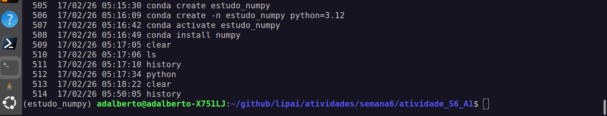
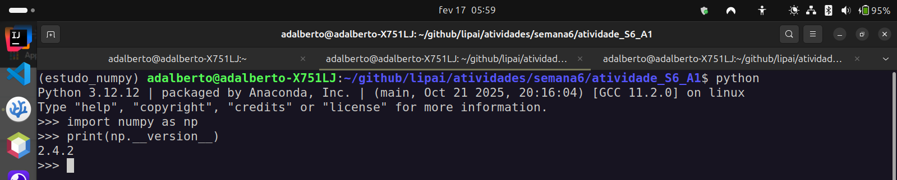

##Saindo do zero com Numpy

### Instalando a biblioteca Numpy no Linux Ubuntu 24.04 em um ambiente com o Anaconda 

1- Primeiro devemos criar um novo ambiente com o comando conda no terminal :

~~~bash
    conda create -n nome_do_ambiente python=3.12 
~~~

2- Acessar o site do [https://numpy.org/](Numpy.org)

Ao entrar no site podemos ver em destaque a versão atual do Numpy, bem como um espaço para o aprendizado mais profundo do mesmo, exemplos técnicos e muitas informações relevantes.

3- Instalando o Numpy:
    Podemos instalar o Numpy usando um ambiente conda como demonstrado abaixo:

~~~bash
    conda activate nome_do_ambiente
    conda install numpy
~~~

Entretanto podemos utilizar o próprio python para criar um ambiente virtual e instalar a biblioteca numpy da seguinte forma:

~~~bash
    # criar um diretório 
    mkdir nome_do_diretório
    # ir para o diretório nome_do_diretorio
    cd nome_do_diretorio
    # criar um ambiente dentro do diretório nome_do_diretorio
    python3 -m venv nome_do_ambiente
    # instalar o numpy
    pip3 install numpy
~~~

Após a instalação o nosso sistema ficará dessa forma abaixo:



Na imagem percebemos que estamos no ambiente virtual chamado estudo_numpy

Podemos verificar se a instalação do Numpy está correta, chamado dentro do terminal o python e depois importando a biblioteca numpy da seguinte forma:
~~~bash
	python
	import numpy as np
	print(np.__version__)
~~~

Ao rodarmos dentro do ambiente do python esse comando teremos o seguinte resultado, como indica a imagem abaixo:



### Conceitos básicos Numpy

1- O Array em Numpy
    É um conjunto de dados, que pode estar disposto em dimensões diferentes, 1 , 2, 3,..., n dimensões diferentes. No numpy temos então uma estrutura de dados que representa essas diferentes possibilidades que é o ndarrays -> Onde n é número d é dimensões:

| Tipo de array                                   | Nome         |
| ----------------------------------------------- | ------------ |
| 1-D array -> array de apenas uma única dimensão | É um vetor   |
| 2-D array -> array de duas dimensões            | É uma matriz |
| 3-D array -> array de 3 ou mais dimensões       | É um tensor  |

2- Definindo um array em numpy

~~~bash
    # abrir o python
    python
    # importar a biblioteca numpy como np
    import numpy as np
    # definir uma variável e criar um objeto do tipo array() em numpy
    a = np.array([1,2,3,4,5,6,7,8,9,10])
    print(a)
~~~

Essa é uma forma de criar os dados manualmente, utilizando a biblioteca numpy.

3- Códigos da Aula 01 sobre Numpy

```python3
""" Aula de Numpy - 01 """

import matplotlib.pyplot as plt
from time import process_time
from numpy.random import default_rng
import numpy as np

# criando um vetor no numpy
vetor = np.array([1, 2, 3, 4, 5, 6])
print(vetor)
print(vetor[0:3])
print(type(vetor))

# criando um array no numpy com zeros e dimensões ( x = 5, y = 3, z = 6 )
zeros_array = np.zeros(shape=(5, 3, 6))
print(zeros_array)

# criando um array no numpy com números um e dimensões ( x = 5, y = 3, z = 6 )
um_arrays = np.ones(shape=(5, 3, 6))
print(um_arrays)

# criando um array empty no numpy
vazio = np.empty((7, 6))
print(vazio)

# criando um array com np.arange([start, ]stop, [step, ]dtype=None, *, like=None)
arr = np.arange(10)  # cria um array com os valores de zero até 9
arr = np.arange(start=100, stop=0, step=-10)
print(arr)

# criando um array que segue uma lógica linear np.linspace()
array_linear = np.linspace(start=0, stop=100, num=20,
                           endpoint=False, retstep=True)
print(array_linear)

# descobrindo dados do array
print(zeros_array.shape)  # mostra as dimensões do array
print(zeros_array.size)  # mostra a quantidade de elementos do array
print(zeros_array.ndim)  # mostra a quantidade de dimensões do array

# mudando o tamanho de um array np.reshape ( array, shape, order {'C', 'F', 'A}, *, copy=None)
# na parte de order pode ter a leitura seguindo o padrão C -> último index é o de maior variação,
# Fortran -> primeiro index é o de maior variação
# A -> também é leitura fortran mas usando memória contígua

print(arr)
arr = arr.reshape((5, 2), order='F')
print(arr)

# Ranqueando um array np.sort( array, axis=-1, kind=None, order=None, *, stable=None )
# axis -1 -> usa o último eixo para fazer o ranque
# kind -> tipo de ordenação quicksort, mergesort, heapsort, timsort, stable
# order -> qual o campo deve ser utilizado para realizar a comparação
# stable -> se verdadeiro True devolve o array com sua ordem relativa
print('---')
arr = np.sort(arr, axis=1, kind='heapsort')
print(arr)

# transformando um vetor 1-D em uma matriz 2-D
# np.newaxis()
a = np.array([1, 2, 3, 4, 5])
print(a.ndim)
a2 = a[np.newaxis, :]
print(a2)

a2 = a[:, np.newaxis]
print(a2)

# acessando valores usa o mesmo prncípio de listas
print(a2[1][0])

# concatenando arrays np.concatenate()
a = np.array([1, 2, 3])
b = np.array([4, 5, 6])

c = np.concatenate((a, b))
d = np.concatenate((b, a))

print(c)
print(d)

# consultando itens de um array
a = np.array([[1, 2, 3], [4, 5, 6], [7, 8, 9]])
print(a)
print('-----')
pares = a[(a % 2 == 0) & ~(a > 5)]  # o and -> & , or -> | , not -> ~
print(pares)

print('------\nOperações com array\n-----')
# operações com arrays
a = np.array([[0, 1, 2, 3], [4, 5, 6, 6.5], [7, 8, 9, 11]])
# na soma os dados devem ser homogenos, se tiver um tamanho diferente , dará erro
print(f"Soma do array -> {a.sum()}")
print(f"Valor máximo no array -> {a.max()}")
print(f"Valor minimo no array -> {a.min()}")
print(f"Valor da média no array -> {a.mean()}")
print(f"Valor da mediana no array -> {np.median(a)}")

# Gerando amostras aleatórias no numpy
# from numpy.random import default_rng

rng = default_rng()
aleatorio = rng
print(aleatorio)
aleatorio = rng.integers(20, size=(3, 3, 2))
print(aleatorio)

# diferenças entre arrays do numpy e listas
# velocidade do array é maior
# array do numpy sempre trabalha com o mesmo tipo de dado, se tiver uma string no meio de ints, tudo será string

# comparando o processamento entre array numpy
# from time import process_time
print('----- Usando listas ----')
lista_a = list(rng.integers(10, 100, 10000000))
lista_b = list(rng.integers(10, 100, 10000000))
c = []
# c = lista_a * lista_b
# Traceback (most recent call last):
#  File "/home/adalberto/github/lipai/atividades/estudo-python/src/08-numpy/aula01.py", line 116, in <module>
#    c = lista_a * lista_b
#        ~~~~~~~~^~~~~~~~~
# TypeError: can't multiply sequence by non-int of type 'list'
t1 = process_time()
for i in range(len(lista_a)):
    c.append(lista_a[i] * lista_b[i])
t2 = process_time()
print(f"Tempo de processamento gasto -> {t2 - t1}")
print('----- Usando numpy ----')
a = rng.integers(10, 100, 10000000)
b = rng.integers(10, 100, 10000000)

t1 = process_time()
c = a * b
t2 = process_time()
print(f"Tempo de processamento gasto -> {t2 - t1}")

# gráficos com numpy
# import matplotlib.pyplot as plt
dados_x = rng.integers(20, size=30)
dados_y = rng.integers(12, size=30)

plt.scatter(x=dados_x, y=dados_y)

plt.show()

```


